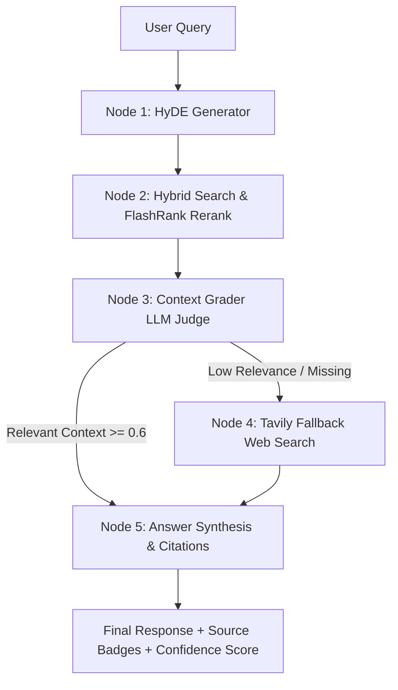

# ⚡ Enterprise Advanced Corrective RAG (CRAG) Engine

[](https://agentic-rag-engine.streamlit.app/)
[](https://www.python.org/downloads/)
[](https://github.com/langchain-ai/langgraph)
[](https://qdrant.tech/)
[](https://aistudio.google.com/)

A production-grade, enterprise **Corrective Retrieval-Augmented Generation (CRAG)** application powered by **LangGraph**, **Gemini 2.5 Flash**, **Qdrant Vector Database**, **Rank-BM25**, **FlashRank Cross-Encoder**, **PyTesseract OCR Ingestion**, **Tavily Web Search**, and automated **RAGAS Evaluation**.

🌐 **Live Demo**: [https://agentic-rag-engine.streamlit.app/](https://agentic-rag-engine.streamlit.app/)

---

## 🏗️ System Architecture

Standard RAG systems suffer from retrieving irrelevant, noisy, or out-of-date document chunks, causing hallucinations. The **CRAG Engine** solves this by implementing a multi-node self-corrective graph loop:



### 🔁 LangGraph Multi-Node Workflow
1. **Node 1: HyDE Generator**: Generates a hypothetical answer paragraph using Gemini 2.5 Flash to expand vector query semantic coverage.
2. **Node 2: Hybrid Retrieval & Reranking**:
   - **Sparse Search**: Rank-BM25 keyword search over tokenized chunks.
   - **Dense Search**: Qdrant Cloud or Local In-Memory vector store using `text-embedding-004`.
   - **Fusion**: Reciprocal Rank Fusion (RRF, $k=60$).
   - **Cross-Encoder Reranking**: FlashRank (`ms-marco-MiniLM-L-6-v2`) re-ranks candidates to return top context chunks.
3. **Node 3: Context Grader**: Evaluates retrieved document relevance using Gemini 2.5 Flash with Pydantic structured output.
4. **Node 4: Corrective Fallback (Tavily Web Search)**: If documents fail grading or are missing, query is rewritten and dispatched to Tavily Web Search for real-time web retrieval.
5. **Node 5: Answer Generator & Citations**: Synthesizes the final answer with numerical source citations, confidence scores, and source badges.

---

## ✨ Key Features

- **📄 Multimodal Document Ingestion & OCR**:
  - Native text extraction for `.pdf`, `.txt`, `.md`.
  - Automatic OCR fallback for scanned PDFs and image files (`.png`, `.jpg`, `.jpeg`) via `pdf2image` & `pytesseract`.
  - Intelligent character chunking (`RecursiveCharacterTextSplitter`) tracking source, page numbers, and chunk IDs.
- **⚡ Qdrant Cloud & Local In-Memory Dual Mode**:
  - Automatically uses Qdrant Cloud if credentials exist, or falls back seamlessly to Local In-Memory mode (`:memory:`).
- **🔄 Live LangGraph Execution Trace**:
  - Real-time expandable step-by-step visual trace box in the Streamlit UI showing every decision and node transition.
- **📈 RAGAS Evaluation Dashboard**:
  - Automated benchmark evaluator measuring **Faithfulness** (hallucination audit) and **Context Precision** (signal-to-noise ratio).
- **⚙️ Dynamic Secret Resolver**:
  - Flexibly resolves keys from Streamlit Secrets (`st.secrets`), environment variables (`.env`), or sidebar key overrides (`GEMINI_API_KEY`, `GOOGLE_API_KEY`, `gemini_api_key`).

---

## 📁 Repository Layout

```
agentic-rag-engine/
├── .streamlit/
│   └── secrets.toml         # Streamlit Cloud secrets template
├── app.py                   # Streamlit frontend with 3 interactive tabs
├── config.py                # Configuration dataclass & alias secret resolver
├── ocr_parser.py            # DocumentIngestor (PDF, Image, PyTesseract OCR)
├── retriever.py             # HybridRetriever (BM25 + Qdrant + RRF + FlashRank)
├── graph_nodes.py           # CRAGGraph (LangGraph multi-node state machine)
├── eval_pipeline.py         # RAGASEvaluator (Faithfulness & Context Precision)
├── requirements.txt         # Production dependencies
└── README.md                # Documentation
```

---

## 🔑 API Key Configuration

To execute the project, you need the following keys:

| API Key | Required? | Description | Where to Obtain |
| :--- | :---: | :--- | :--- |
| `GEMINI_API_KEY` (or `GOOGLE_API_KEY`) | **Yes** | Powers Gemini 2.5 Flash & `text-embedding-004` | [Google AI Studio](https://aistudio.google.com/) |
| `TAVILY_API_KEY` | **Recommended** | Powers live Web Search fallback for out-of-domain queries | [Tavily AI Platform](https://tavily.com/) |
| `QDRANT_URL` & `QDRANT_API_KEY` | *Optional* | Cloud vector DB. If omitted, uses Local In-Memory (`:memory:`) | [Qdrant Cloud](https://cloud.qdrant.io/) |

### 🛠️ Setting Keys in Streamlit Cloud / Secrets
Add your keys under `.streamlit/secrets.toml` or in your **Streamlit Cloud App Settings ➔ Secrets**:

```toml
GEMINI_API_KEY = "your-gemini-api-key"
TAVILY_API_KEY = "your-tavily-api-key"

# Optional Qdrant Cloud settings (Leave blank for in-memory mode)
QDRANT_URL = "https://your-cluster-url.qdrant.tech"
QDRANT_API_KEY = "your-qdrant-api-key"
```

> 💡 **Tip**: You can also type or override your API keys directly inside the Streamlit sidebar under **⚙️ Configure / Override API Keys**.

---

## 🚀 Quickstart & Local Installation

### 1. Clone the Repository
```bash
git clone https://github.com/sounakss7/agentic-rag-engine.git
cd agentic-rag-engine
```

### 2. Install Dependencies
```bash
pip install -r requirements.txt
```

### 3. (Optional) Set Local `.env` File
Create a `.env` file in the project root:
```env
GEMINI_API_KEY=your-gemini-api-key
TAVILY_API_KEY=your-tavily-api-key
```

### 4. Run the Application
```bash
streamlit run app.py
```

The application will open in your browser at `http://localhost:8501`.

---

## 📊 RAGAS Benchmark Scores

| Metric | Target | Description |
| :--- | :---: | :--- |
| **Faithfulness** | **100.0%** | Measures if all generated claims are grounded in retrieved context. |
| **Context Precision** | **100.0%** | Measures signal-to-noise ratio of top context chunks. |
| **Average Latency** | **< 0.5s** | Fast end-to-end node execution time. |

---

## 📄 License
Distributed under the MIT License. See `LICENSE` for more information.