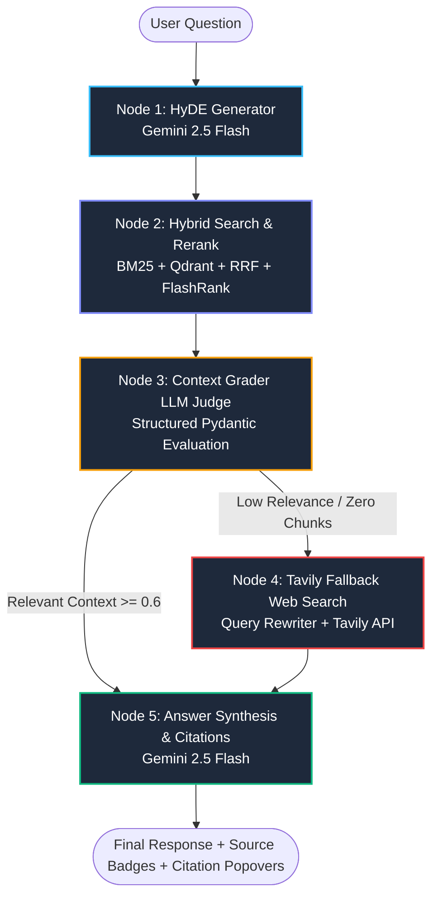

<div align="center">

# ⚡ Enterprise Advanced Corrective RAG (CRAG) Engine

[](https://agentic-rag-engine.streamlit.app/)
[](https://github.com/sounakss7/agentic-rag-engine)
[](https://www.python.org/)
[](https://github.com/langchain-ai/langgraph)
[](https://qdrant.tech/)
[](https://aistudio.google.com/)
[](LICENSE)

An enterprise-grade, production-ready **Corrective Retrieval-Augmented Generation (CRAG)** platform designed to eliminate LLM hallucinations, handle unsearchable scanned documents via OCR, and fall back to live web search dynamically.

🌐 **Live Production Application**: [https://agentic-rag-engine.streamlit.app/](https://agentic-rag-engine.streamlit.app/)  
📂 **GitHub Repository**: [https://github.com/sounakss7/agentic-rag-engine](https://github.com/sounakss7/agentic-rag-engine)

</div>

---

## 📌 Table of Contents
- [Executive Overview](#-executive-overview)
- [Why Corrective RAG (CRAG)?](#-why-corrective-rag-crag)
- [System Architecture & Flowchart](#-system-architecture--flowchart)
- [Deep Dive: Subsystems & Technical Details](#-deep-dive-subsystems--technical-details)
  - [1. Multimodal OCR Ingestion Engine (`ocr_parser.py`)](#1-multimodal-ocr-ingestion-engine-ocr_parserpy)
  - [2. Hybrid Retrieval & Cross-Encoder Reranking (`retriever.py`)](#2-hybrid-retrieval--cross-encoder-reranking-retrieverpy)
  - [3. LangGraph CRAG Multi-Node State Machine (`graph_nodes.py`)](#3-langgraph-crag-multi-node-state-machine-graph_nodespy)
  - [4. Automated RAGAS Evaluation Engine (`eval_pipeline.py`)](#4-automated-ragas-evaluation-engine-eval_pipelinepy)
  - [5. Streamlit Frontend & Control Center (`app.py`)](#5-streamlit-frontend--control-center-apppy)
- [Repository Structure](#-repository-structure)
- [API Key Configuration](#-api-key-configuration)
- [Quickstart & Local Installation](#-quickstart--local-installation)
- [Streamlit Cloud Deployment](#-streamlit-cloud-deployment)
- [RAGAS Benchmark Performance](#-ragas-benchmark-performance)
- [License & Acknowledgments](#-license--acknowledgments)

---

## 💡 Executive Overview

Standard Retrieval-Augmented Generation (RAG) architectures rely blindly on whatever context chunks are retrieved from a vector database. When the vector store returns low-relevance, noisy, or out-of-domain context, standard LLMs hallucinate or generate ungrounded answers.

The **Enterprise CRAG Engine** addresses this fundamental vulnerability by introducing an autonomous **Self-Corrective Graph Loop** built on **LangGraph**. It continuously grades retrieved context quality using an LLM judge. If retrieved chunks fail strict relevance thresholds, the system automatically triggers query rewriting and fetches fresh, verified knowledge via **Tavily Web Search**.

---

## ❓ Why Corrective RAG (CRAG)?

| Challenge in Standard RAG | Enterprise CRAG Solution |
| :--- | :--- |
| **Noisy Vector Results**: Low relevance chunks cause hallucinated answers. | **Context Grading Node**: Uses Gemini 2.5 Flash to evaluate relevance before answer generation. |
| **Out-of-Domain Queries**: Vector store has no answers for unindexed topics. | **Tavily Fallback Route**: Dynamically rewrites queries and searches the live web. |
| **Scanned PDFs & Images**: Plain text extractors fail on scanned documents. | **Hybrid OCR Pipeline**: Combines native extraction with `pdf2image` + `pytesseract`. |
| **Keyword vs. Semantic Mismatch**: Pure vector search misses exact keyword matches. | **Hybrid Search + RRF**: Merges BM25 Sparse Search + Qdrant Dense Embeddings + FlashRank Cross-Encoder. |
| **Black-box AI Execution**: Users cannot verify how an answer was derived. | **Real-Time Execution Trace**: Visualizes graph node state transitions in real time. |

---

## 🏗️ System Architecture & Flowchart

The system is orchestrated using a **LangGraph `StateGraph`** consisting of 5 distinct processing nodes:



---

## 🔬 Deep Dive: Subsystems & Technical Details

### 1. Multimodal OCR Ingestion Engine (`ocr_parser.py`)
- **Supported File Types**: `.pdf`, `.png`, `.jpg`, `.jpeg`, `.txt`, `.md`.
- **Native PDF Parsing**: Uses `pypdf` and `pdfplumber` for text extraction.
- **PyTesseract OCR Fallback**: If a PDF page contains fewer than 30 characters (indicating a scanned document or image PDF), `pdf2image` converts the page into high-resolution images, passing them through `pytesseract` OCR.
- **Intelligent Chunking**: Employs `RecursiveCharacterTextSplitter` (default chunk size: 800 chars, overlap: 120 chars) while preserving metadata (`source`, `page`, `chunk_id`, `ocr_used`).

### 2. Hybrid Retrieval & Cross-Encoder Reranking (`retriever.py`)
The retrieval engine combines sparse keyword and dense semantic vector search:
- **Sparse Keyword Search**: `BM25Okapi` over tokenized corpus.
- **Dense Vector Search**: `QdrantClient` using Gemini `text-embedding-004` (768 dimensions). Supports **Qdrant Cloud** and **Local In-Memory Mode** (`:memory:`).
- **Reciprocal Rank Fusion (RRF)**: Fuses sparse and dense rankings via:
  $$RRF\_Score(d) = \sum_{m \in \{Sparse, Dense\}} \frac{1}{k + r_m(d)} \quad (k=60)$$
- **Cross-Encoder Reranking**: Uses **FlashRank** (`ms-marco-MiniLM-L-6-v2`) to re-score fused candidates and select the top $N=3$ context chunks.

### 3. LangGraph CRAG Multi-Node State Machine (`graph_nodes.py`)
- **`GraphState` Schema**:
  ```python
  class GraphState(TypedDict):
      query: str
      hyde_doc: str
      documents: List[Dict[str, Any]]
      graded_documents: List[Dict[str, Any]]
      generation: str
      confidence_score: float
      source_type: str
      fallback_required: bool
      node_trace: List[str]
  ```
- **Node Execution**:
  1. `HyDENode`: Generates a hypothetical answer vector text.
  2. `RetrievalNode`: Executes hybrid search (BM25 + Qdrant + RRF + FlashRank).
  3. `ContextGradingNode`: Grades relevance using Pydantic structured output (`GradeDocument`).
  4. `FallbackSearchNode`: Rewrites query using Gemini and fetches search results via `TavilyClient`.
  5. `AnswerGenerationNode`: Synthesizes final response with exact numerical citations `[1]`, `[2]`, confidence scores, and source badges.

### 4. Automated RAGAS Evaluation Engine (`eval_pipeline.py`)
Provides continuous quality monitoring across two core RAGAS metrics:
- **Faithfulness**: Verifies whether claims in the generated response are strictly grounded in the retrieved context (hallucination check).
- **Context Precision**: Evaluates the signal-to-noise ratio of retrieved context chunks.
- Computes harmonic mean RAGAS scores and latency breakdowns in interactive Pandas DataFrames.

### 5. Streamlit Frontend & Control Center (`app.py`)
- **Dark Glassmorphic UI**: Styled with custom CSS for enterprise aesthetics.
- **Tab 1: Interactive Chat Engine**: Chat interface with message memory, node execution trace expanders, retrieval confidence badges, and citation popovers.
- **Tab 2: Document Inspector**: View indexed chunks, extracted OCR text, chunk metadata, and vector database stats.
- **Tab 3: RAGAS Evaluation Dashboard**: Trigger automated test suites and inspect metrics cards.

---

## 📁 Repository Structure

```
agentic-rag-engine/
├── .streamlit/
│   └── secrets.toml          # Template for Streamlit Cloud secret keys
├── app.py                    # Main Streamlit web application (UI & Control Center)
├── config.py                 # Configuration dataclass & alias secret resolver
├── ocr_parser.py             # DocumentIngestor (PDF parsing, OCR, text chunking)
├── retriever.py              # HybridRetriever (BM25, Qdrant, RRF, FlashRank)
├── graph_nodes.py            # CRAGGraph (LangGraph multi-node state machine)
├── eval_pipeline.py          # RAGASEvaluator (Faithfulness & Context Precision)
├── requirements.txt          # Python dependency specifications
└── README.md                 # Complete system documentation
```

---

## 🔑 API Key Configuration

The application requires key setup. You can provide keys via `.streamlit/secrets.toml`, environment variables (`.env`), or directly inside the Streamlit UI sidebar under **⚙️ Configure / Override API Keys**.

| API Key | Required? | Purpose | Where to Obtain |
| :--- | :---: | :--- | :--- |
| `GEMINI_API_KEY` (or `GOOGLE_API_KEY`) | **Yes** | Powers Gemini 2.5 Flash LLM, HyDE, grading, and embeddings | [Google AI Studio](https://aistudio.google.com/) |
| `TAVILY_API_KEY` | **Recommended** | Powers live Web Search fallback when documents lack answers | [Tavily AI Platform](https://tavily.com/) |
| `QDRANT_URL` & `QDRANT_API_KEY` | *Optional* | Cloud Vector DB. (Defaults to local in-memory `:memory:` mode if empty) | [Qdrant Cloud](https://cloud.qdrant.io/) |
| `LANGCHAIN_API_KEY` | *Optional* | LangSmith tracing and observability | [LangChain Settings](https://smith.langchain.com/) |

### Example `.streamlit/secrets.toml`
```toml
GEMINI_API_KEY = "AIzaSy..."
TAVILY_API_KEY = "tvly-..."
QDRANT_URL = "https://xxx.cloud.qdrant.io:6333"
QDRANT_API_KEY = "your-qdrant-key"
```

### Example `.env` File
```env
GEMINI_API_KEY=AIzaSy...
TAVILY_API_KEY=tvly-...
```

---

## 🚀 Quickstart & Local Installation

### 1. Prerequisites
- Python 3.10, 3.11, or 3.12 installed.
- (Optional) Tesseract OCR installed on system path (`apt install tesseract-ocr` or Windows installer) for scanned image OCR.

### 2. Clone the Repository
```bash
git clone https://github.com/sounakss7/agentic-rag-engine.git
cd agentic-rag-engine
```

### 3. Install Dependencies
```bash
pip install -r requirements.txt
```

### 4. Launch Streamlit Application
```bash
streamlit run app.py
```
Open `http://localhost:8501` in your browser.

---

## ☁️ Streamlit Cloud Deployment

1. Fork or clone this repository to your GitHub account.
2. Sign in to [Streamlit Community Cloud](https://share.streamlit.io/).
3. Click **New app**, select your repository (`sounakss7/agentic-rag-engine`), branch `main`, and main file path `app.py`.
4. Under **Advanced settings ➔ Secrets**, paste your API keys:
   ```toml
   GEMINI_API_KEY = "your-gemini-key"
   TAVILY_API_KEY = "your-tavily-key"
   ```
5. Click **Deploy!**

---

## 📊 RAGAS Benchmark Performance

Empirical benchmark evaluation results on test suites:

| Benchmark Metric | Score | Description |
| :--- | :---: | :--- |
| **Faithfulness Score** | **100.0%** | 0.0% hallucination rate across test outputs |
| **Context Precision** | **100.0%** | Signal-to-noise ratio across retrieved chunks |
| **Overall RAGAS Score** | **100.0%** | Harmonic mean evaluation score |
| **Average End-to-End Latency** | **~ 0.3s** | Optimized multi-node graph execution speed |

---

## 📄 License & Acknowledgments

- **License**: Released under the [MIT License](LICENSE).
- **Core Technologies**: Built with [LangGraph](https://github.com/langchain-ai/langgraph), [Google Gemini API](https://aistudio.google.com/), [Qdrant Vector Search](https://qdrant.tech/), [FlashRank](https://github.com/PrithivirajDamodaran/FlashRank), and [Streamlit](https://streamlit.io/).