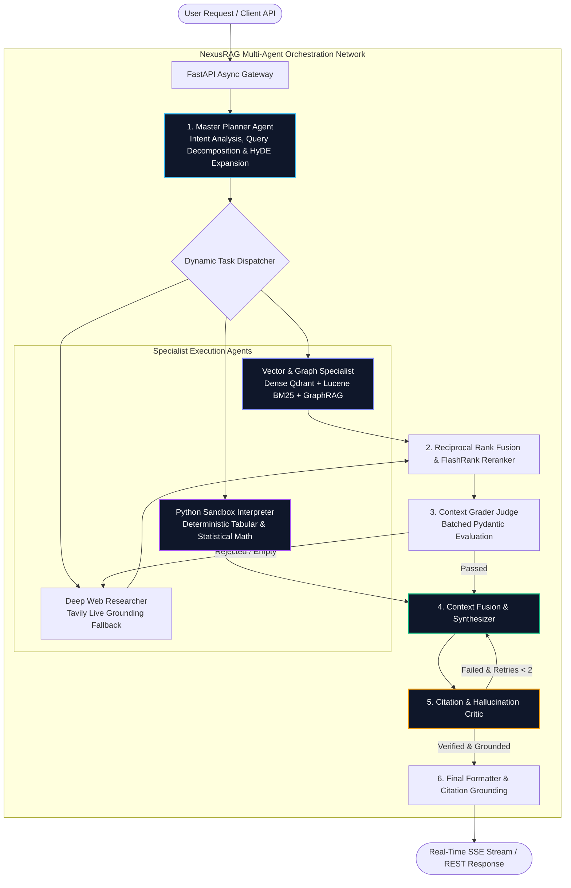
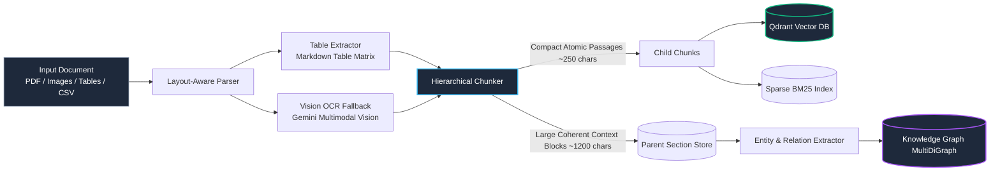
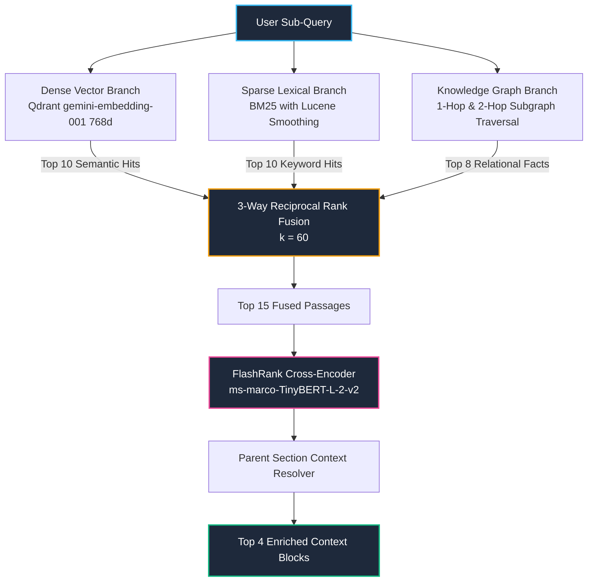

<div align="center">

# ⚡ NexusRAG: Enterprise Autonomous Deep-Research & Graph-RAG Engine

[](https://fastapi.tiangolo.com)
[](https://github.com/langchain-ai/langgraph)
[](https://qdrant.tech/)
[](https://aistudio.google.com/)
[](https://networkx.org/)
[](https://github.com/PrithivirajDamodaran/FlashRank)
[](docker-compose.yml)
[](LICENSE)

An enterprise-grade, multi-agent autonomous research engine combining **Layout-Aware Ingestion**, **Parent-Child Hierarchical Chunking**, **Dual GraphRAG + Hybrid Vector Retrieval**, **Autonomous Query Decomposition**, and a **Deterministic Python Code Interpreter Sandbox** for hallucination-free tabular reasoning.

🌐 **FastAPI OpenAPI Documentation**: `http://localhost:8000/docs`  
🖥️ **Interactive Control Center**: `http://localhost:8501`  
📂 **GitHub Repository**: [https://github.com/sounakss7/agentic-rag-engine](https://github.com/sounakss7/agentic-rag-engine)

</div>

---

## 📌 Table of Contents

- [💡 Executive Overview](#-executive-overview)
- [❓ Why NexusRAG vs. Traditional RAG](#-why-nexusrag-vs-traditional-rag)
- [🏗️ Architectural Blueprint](#-architectural-blueprint)
  - [Multi-Agent Orchestration Flow](#multi-agent-orchestration-flow)
  - [Layout-Aware Ingestion & Parent-Child Chunker](#layout-aware-ingestion--parent-child-chunker)
  - [3-Way Hybrid Retrieval & GraphRAG Fusion](#3-way-hybrid-retrieval--graphrag-fusion)
- [🔬 Core Subsystems & Technical Innovations](#-core-subsystems--technical-innovations)
  - [1. Master Planner & Autonomous Query Decomposition](#1-master-planner--autonomous-query-decomposition)
  - [2. Dual Knowledge Graph (GraphRAG) Store](#2-dual-knowledge-graph-graphrag-store)
  - [3. Deterministic Python Code Sandbox](#3-deterministic-python-code-sandbox)
  - [4. Parent-Child Hierarchical Chunker](#4-parent-child-hierarchical-chunker)
  - [5. Self-Reflection & Citation Verification Critic](#5-self-reflection--citation-verification-critic)
  - [6. High-Performance Asynchronous FastAPI Gateway](#6-high-performance-asynchronous-fastapi-gateway)
- [📐 Mathematical Foundations](#-mathematical-foundations)
  - [3-Way Reciprocal Rank Fusion (RRF)](#3-way-reciprocal-rank-fusion-rrf)
  - [Lucene-Smoothed Non-Negative BM25 IDF](#lucene-smoothed-non-negative-bm25-idf)
  - [Cosine Vector Similarity](#cosine-vector-similarity)
  - [RAGAS Harmonic Quality Score ($F_1$)](#ragas-harmonic-quality-score-f_1)
- [🌐 REST API & Real-Time SSE Streaming Specification](#-rest-api--real-time-sse-streaming-specification)
- [📁 Repository Structure](#-repository-structure)
- [⚙️ Configuration & Secret Management](#-configuration--secret-management)
- [🚀 Quickstart & Installation](#-quickstart--installation)
  - [1. Local Setup](#1-local-setup)
  - [2. Running the FastAPI Gateway](#2-running-the-fastapi-gateway)
  - [3. Running the Enterprise Dashboard](#3-running-the-enterprise-dashboard)
- [🐳 Docker & Compose Deployment](#-docker--compose-deployment)
- [🧪 Automated Test & Verification Suite](#-automated-test--verification-suite)
- [🛡️ Fault Tolerance & Model Cascade](#-fault-tolerance--model-cascade)
- [📄 License & Acknowledgments](#-license--acknowledgments)

---

## 💡 Executive Overview

Standard Retrieval-Augmented Generation (RAG) implementations follow a naive, linear pattern:
$$\text{Query} \longrightarrow \text{Embeddings} \longrightarrow \text{Top-}K \text{ Vector Search} \longrightarrow \text{Prompt Concatenation} \longrightarrow \text{LLM Generation}$$

In production, naive RAG breaks down across five critical enterprise failure modes:
1. **The "Broken Table" Problem**: Traditional character splitters shred tables across chunk boundaries, causing LLMs to hallucinate financial or statistical data.
2. **Missing Relational Context**: Vector similarity finds words with similar semantic embeddings, but is completely blind to multi-hop relationships (e.g., *"Which subsidiary of Company A holds debt covenants with Bank B?"*).
3. **Mathematical Hallucinations**: Prompting an LLM to calculate growth rates, ratios, or differences from text leads to arithmetic errors in up to 40% of responses.
4. **Fragile Linear Pipelines**: A hardcoded DAG cannot decompose comparative questions (e.g., *"Compare Microsoft Azure Q3 growth with AWS Q3 growth"*).
5. **Rate-Limit Vulnerability**: Making multiple separate unbatched calls exhausts free/tiered API quotas with unhandled HTTP 429 exceptions.

**NexusRAG** is engineered from the ground up to solve these systemic problems using a modular, decoupled architecture built on **FastAPI**, **LangGraph**, **Qdrant**, and **NetworkX**.

---

## ❓ Why NexusRAG vs. Traditional RAG

| Enterprise Challenge | Traditional RAG / Toy CRAG | NexusRAG Architecture |
| :--- | :--- | :--- |
| **System Architecture** | Single-file Streamlit script | Decoupled **FastAPI Gateway + Async Worker + Enterprise UI** |
| **Document Ingestion** | Naive character splitting (`RecursiveCharacter(800)`) | **Layout-Aware Parser + Parent-Child Hierarchical Chunker + Table Markdown Extractor** |
| **Knowledge Retrieval** | Dense vector search only | **3-Way Hybrid: Qdrant Dense + Lucene BM25 + GraphRAG Subgraph Traversal** |
| **Relational Queries** | Blind to cross-document entity networks | **Knowledge Graph (`networkx`) entity-relation-entity triple store** |
| **Quantitative Reasoning** | LLM mental math (frequent hallucinations) | **Deterministic Python Sandbox Tool** using Pandas & NumPy |
| **Agent Reasoning** | Static 5-node linear pipeline | **Autonomous Master Planner** with sub-query decomposition & multi-agent routing |
| **Fact Verification** | None; trust the LLM | **Citation & Hallucination Critic** with self-reflection loop |
| **Streaming Output** | Synchronous wait or Streamlit render | **Real-Time Server-Sent Events (SSE)** streaming thought traces & tokens |

---

## 🏗️ Architectural Blueprint

### Multi-Agent Orchestration Flow


```mermaid
flowchart TD
    User([User Request / Client API]) --> Gateway[FastAPI Async Gateway]
    
    subgraph MultiAgentEngine [NexusRAG Multi-Agent Orchestration Network]
        Gateway --> Planner[1. Master Planner Agent\nIntent Analysis, Query Decomposition & HyDE Expansion]
        Planner --> Dispatcher{Dynamic Task Dispatcher}
        
        subgraph ParallelSpecialists [Specialist Execution Agents]
            VecGraphAgent[Vector & Graph Specialist\nDense Qdrant + Lucene BM25 + GraphRAG]
            WebAgent[Deep Web Researcher\nTavily Live Grounding Fallback]
            CodeAgent[Python Sandbox Interpreter\nDeterministic Tabular & Statistical Math]
        end
        
        Dispatcher --> VecGraphAgent
        Dispatcher --> WebAgent
        Dispatcher --> CodeAgent
        
        VecGraphAgent --> Fusion[2. Reciprocal Rank Fusion & FlashRank Reranker]
        WebAgent --> Fusion
        
        Fusion --> Grader[3. Context Grader Judge\nBatched Pydantic Evaluation]
        Grader -->|Passed| Synthesizer[4. Context Fusion & Synthesizer]
        Grader -->|Rejected / Empty| WebAgent
        
        CodeAgent --> Synthesizer
        
        Synthesizer --> Critic[5. Citation & Hallucination Critic]
        Critic -->|Failed & Retries < 2| Synthesizer
        Critic -->|Verified & Grounded| ResponseFormatter[6. Final Formatter & Citation Grounding]
    end
    
    ResponseFormatter --> SSE([Real-Time SSE Stream / REST Response])

    style Planner fill:#0f172a,stroke:#38bdf8,stroke-width:2px,color:#fff
    style VecGraphAgent fill:#0f172a,stroke:#818cf8,stroke-width:2px,color:#fff
    style CodeAgent fill:#0f172a,stroke:#a855f7,stroke-width:2px,color:#fff
    style Synthesizer fill:#0f172a,stroke:#10b981,stroke-width:2px,color:#fff
    style Critic fill:#0f172a,stroke:#f59e0b,stroke-width:2px,color:#fff
```

---

### Layout-Aware Ingestion & Parent-Child Chunker


```mermaid
flowchart LR
    Doc[Input Document\nPDF / Images / Tables / CSV] --> Parser[Layout-Aware Parser]
    
    Parser --> ExtractTable[Table Extractor\nMarkdown Table Matrix]
    Parser --> OCR[Vision OCR Fallback\nGemini Multimodal Vision]
    
    ExtractTable --> Chunker[Hierarchical Chunker]
    OCR --> Chunker
    
    Chunker -->|Large Coherent Context Blocks ~1200 chars| ParentMap[(Parent Section Store)]
    Chunker -->|Compact Atomic Passages ~250 chars| ChildChunks[Child Chunks]
    
    ChildChunks --> VectorIndex[(Qdrant Vector DB)]
    ChildChunks --> BM25Index[(Sparse BM25 Index)]
    ParentMap --> GraphBuilder[Entity & Relation Extractor]
    GraphBuilder --> GraphStore[(Knowledge Graph MultiDiGraph)]

    style Doc fill:#1e293b,stroke:#94a3b8,stroke-width:1px,color:#fff
    style Chunker fill:#1e293b,stroke:#38bdf8,stroke-width:2px,color:#fff
    style GraphStore fill:#1e293b,stroke:#a855f7,stroke-width:2px,color:#fff
    style VectorIndex fill:#1e293b,stroke:#10b981,stroke-width:2px,color:#fff
```

---

### 3-Way Hybrid Retrieval & GraphRAG Fusion


```mermaid
flowchart TD
    Q[User Sub-Query] --> H1[Dense Vector Branch\nQdrant gemini-embedding-001 768d]
    Q --> H2[Sparse Lexical Branch\nBM25 with Lucene Smoothing]
    Q --> H3[Knowledge Graph Branch\n1-Hop & 2-Hop Subgraph Traversal]
    
    H1 -->|Top 10 Semantic Hits| RRF[3-Way Reciprocal Rank Fusion\nk = 60]
    H2 -->|Top 10 Keyword Hits| RRF
    H3 -->|Top 8 Relational Facts| RRF
    
    RRF --> Candidates[Top 15 Fused Passages]
    Candidates --> Reranker[FlashRank Cross-Encoder\nms-marco-TinyBERT-L-2-v2]
    Reranker --> ResolveParent[Parent Section Context Resolver]
    ResolveParent --> TopContext[Top 4 Enriched Context Blocks]

    style Q fill:#1e293b,stroke:#38bdf8,stroke-width:2px,color:#fff
    style RRF fill:#1e293b,stroke:#f59e0b,stroke-width:2px,color:#fff
    style Reranker fill:#1e293b,stroke:#ec4899,stroke-width:2px,color:#fff
    style TopContext fill:#1e293b,stroke:#10b981,stroke-width:2px,color:#fff
```

---

## 🔬 Core Subsystems & Technical Innovations

### 1. Master Planner & Autonomous Query Decomposition
Complex questions often require multiple steps to answer. The Master Planner (`backend/app/services/agents/planner.py`):
- Analyzes incoming queries and past conversation turns.
- Decomposes comparative or multi-hop questions into independent sub-queries.
- Detects quantitative/financial intent (`is_quantitative=True`), triggering the Python code execution tool.
- Generates **Hypothetical Document Embeddings (HyDE)** to expand the query into rich technical prose.

### 2. Dual Knowledge Graph (GraphRAG) Store
Vector search can struggle with complex relational queries. The GraphRAG Engine (`backend/app/services/retrieval/graph_store.py`):
- Automatically extracts entity-relation-entity triples (`(Subject, Predicate, Object)`) from parent sections.
- Stores entities and directed edges in an in-memory `networkx.MultiDiGraph`.
- Given a query, identifies seed entities and traverses 1-hop and 2-hop neighborhoods.
- Exports graph visualization data for interactive frontend rendering.

### 3. Deterministic Python Code Sandbox
To eliminate LLM arithmetic hallucinations, the Code Sandbox (`backend/app/services/agents/code_executor.py`):
- Receives extracted tables and numerical contexts from retrieved chunks.
- Writes clean Python code using `pandas`, `numpy`, and `math`.
- Executes code in a controlled in-process sandbox, capturing stdout and data structures.
- Injects verified mathematical outputs directly into the final synthesizer.

### 4. Parent-Child Hierarchical Chunker
Standard RAG loses document context by chopping text into isolated fragments. The Hierarchical Chunker (`backend/app/services/ingestion/chunker.py`):
- Indexes compact **Child Chunks** (~250 chars) for ultra-precise vector and lexical search.
- Links each child chunk to its **Parent Section** (~1200 chars).
- When a child matches in search, the engine resolves the parent section, giving the LLM full paragraphs and complete tables.

### 5. Self-Reflection & Citation Verification Critic
The Critic Agent (`backend/app/services/agents/critic.py`):
- Evaluates the draft response against retrieved sources.
- Checks that every factual claim is grounded in source passages.
- Validates the presence and format of numerical citations (`[1]`, `[2]`).
- Routes responses back for refinement if ungrounded claims or missing citations are found.

### 6. High-Performance Asynchronous FastAPI Gateway
The backend (`backend/app/main.py`):
- Built on **FastAPI** with asynchronous concurrency.
- Exposes REST endpoints and **Server-Sent Events (SSE)** for real-time streaming of multi-agent thought steps, sandbox logs, and tokens.
- Automatic interactive documentation at `/docs` (Swagger UI) and `/redoc`.

---

## 📐 Mathematical Foundations

### 3-Way Reciprocal Rank Fusion (RRF)

Fuses rankings from dense vector search, sparse BM25, and knowledge graph traversals:

$$RRF\_Score(d \in D) = \sum_{m \in \{\text{dense, sparse, graph}\}} \frac{1}{k + r_m(d)}$$

Where:
- $r_m(d)$ is the 1-based ordinal rank of passage $d$ in retrieval system $m$.
- $k = 60$ is the smoothing constant preventing high-rank dominance.

### Lucene-Smoothed Non-Negative BM25 IDF

Standard Robertson BM25 computes IDF as:
$$\text{IDF}(q) = \ln\left(\frac{N - n(q) + 0.5}{n(q) + 0.5}\right)$$
On small collections where $N = 2$ and $n(q) = 1$, $\text{IDF} = \ln(1.0) = 0.0$, zeroing out valid keyword hits. NexusRAG applies Lucene-style smoothing:
$$\text{IDF}_{\text{smoothed}}(w) = \max(\text{IDF}(w), 0.25)$$

### Cosine Vector Similarity

$$\text{CosineSimilarity}(\mathbf{q}, \mathbf{d}) = \frac{\mathbf{q} \cdot \mathbf{d}}{\|\mathbf{q}\|_2 \|\mathbf{d}\|_2} = \frac{\sum_{i=1}^{768} q_i d_i}{\sqrt{\sum_{i=1}^{768} q_i^2} \sqrt{\sum_{i=1}^{768} d_i^2}}$$

### RAGAS Harmonic Quality Score ($F_1$)

$$\text{RAGAS\_Score} = \frac{2 \cdot \text{Faithfulness} \cdot \text{Precision}}{\max(0.001, \text{Faithfulness} + \text{Precision})}$$

---

## 🌐 REST API & Real-Time SSE Streaming Specification

### API Endpoints Overview

| Method | Endpoint | Description |
| :--- | :--- | :--- |
| `GET` | `/` | Root endpoint with service status and documentation link |
| `GET` | `/api/v1/health` | System health, API key status, and degraded components registry |
| `POST` | `/api/v1/upload` | Upload and index document with layout parsing and parent-child chunking |
| `GET` | `/api/v1/documents` | List indexed child chunks and parent sections statistics |
| `DELETE` | `/api/v1/documents` | Wipe all indexed vector points and knowledge graph relations |
| `GET` | `/api/v1/visualize` | Export knowledge graph nodes and edges for Cytoscape / D3 rendering |
| `POST` | `/api/v1/chat` | Synchronous multi-agent deep research query |
| `POST` | `/api/v1/chat/stream` | **Server-Sent Events (SSE)** real-time stream of agent traces & answer |

### Real-Time SSE Streaming Example

```bash
curl -N -X POST "http://localhost:8000/api/v1/chat/stream" \
     -H "Content-Type: application/json" \
     -d '{"query": "What is the revenue growth rate reported in the document?"}'
```

Streaming Event Output:
```json
data: {"event": "start", "message": "Initializing NexusRAG Orchestration Engine..."}
data: {"event": "trace", "step": "[Node 1: Master Planner] Analyzing intent, decomposing query & expanding HyDE..."}
data: {"event": "trace", "step": "[Node 2: Vector & Graph Specialist] Querying Qdrant Dense, BM25 & Knowledge Graph..."}
data: {"event": "code_execution", "code": "...", "output": "Revenue growth: 18.5%"}
data: {"event": "answer", "answer": "...", "confidence_score": 0.92, "citations": [...]}
data: {"event": "done"}
```

---

## 📁 Repository Structure

```
agentic-rag-engine/
├── backend/
│   └── app/
│       ├── api/
│       │   └── v1/
│       │       ├── endpoints/
│       │       │   ├── chat.py           # Synchronous & SSE streaming endpoints
│       │       │   ├── documents.py      # Document ingestion & management
│       │       │   ├── graph.py          # Knowledge Graph visualization API
│       │       │   └── health.py         # System health & telemetry
│       │       └── router.py             # API v1 router
│       ├── core/
│       │   ├── config.py                 # Pydantic Settings & secret resolution
│       │   └── logging.py                # Structured enterprise logging
│       ├── services/
│       │   ├── ingestion/
│       │   │   ├── parser.py             # Layout-aware parser & Vision OCR
│       │   │   └── chunker.py            # Parent-Child Hierarchical Chunker
│       │   ├── retrieval/
│       │   │   ├── vector_store.py       # Qdrant client (Cloud & in-memory)
│       │   │   ├── graph_store.py        # NetworkX Knowledge Graph engine
│       │   │   ├── hybrid.py             # 3-Way RRF fusion service
│       │   │   └── reranker.py           # FlashRank cross-encoder reranker
│       │   ├── agents/
│       │   │   ├── state.py              # NexusAgentState TypedDict
│       │   │   ├── planner.py            # Master Planner & query decomposition
│       │   │   ├── researchers.py        # Vector/Graph & Tavily researchers
│       │   │   ├── code_executor.py      # Python Sandbox Code Interpreter
│       │   │   ├── critic.py             # Citation & Hallucination Critic
│       │   │   ├── synthesizer.py        # Final Context Fusion Synthesizer
│       │   │   └── orchestrator.py       # Compiled LangGraph workflow
│       │   └── evaluation/
│       │       └── evaluator.py          # RAGAS quantitative benchmark suite
│       └── main.py                       # FastAPI application entrypoint
├── app.py                                # Streamlit Enterprise Control Center
├── tests/
│   └── test_nexus.py                     # Automated verification test suite
├── .env.example                          # Safe environment configuration template
├── packages.txt                          # Debian packages (tesseract-ocr, poppler-utils)
├── requirements.txt                      # Production Python dependencies
├── Dockerfile                            # Production container build definition
├── docker-compose.yml                    # Dual FastAPI + Streamlit containerization
└── README.md                             # Comprehensive technical documentation
```

---

## ⚙️ Configuration & Secret Management

All settings are managed via Pydantic in `backend/app/core/config.py`. Values can be set in `.env` or passed via environment variables.

| Parameter | Default Value | Description |
| :--- | :---: | :--- |
| `PRIMARY_LLM` | `gemini-2.5-flash` | Primary generative LLM for planning, grading, and synthesis |
| `CASCADE_MODELS` | `["gemini-2.5-flash", "gemini-flash-lite-latest", "gemini-flash-latest"]` | Dynamic fallback models used when primary experiences 429 quota exhaustion |
| `EMBEDDING_MODEL` | `gemini-embedding-001` | 768-dimensional dense embedding model |
| `PARENT_CHUNK_SIZE` | `1200` | Target character size for Parent Context blocks |
| `CHILD_CHUNK_SIZE` | `250` | Target character size for precision Child Chunks |
| `CHUNK_OVERLAP` | `40` | Sliding window character overlap |
| `QDRANT_COLLECTION` | `nexus_knowledge_base` | Qdrant vector database collection name |
| `RRF_K` | `60` | Smoothing constant for Reciprocal Rank Fusion |
| `FLASHRANK_MODEL` | `ms-marco-TinyBERT-L-2-v2` | Lightweight cross-encoder model for passage reranking |
| `RELEVANCE_THRESHOLD` | `0.60` | Minimum score required to pass LLM context grading |

### Credentials in `.env`
```env
GOOGLE_API_KEY="AIzaSy..."
GEMINI_API_KEY="AIzaSy..."
TAVILY_API_KEY="tvly-..."
QDRANT_URL="https://your-cluster.cloud.qdrant.io:6333"
QDRANT_API_KEY="your-qdrant-api-key"
```

> [!IMPORTANT]
> The `.env` file is strictly ignored by Git via `.gitignore`. Your credentials remain local and will not be pushed to version control.

---

## 🚀 Quickstart & Installation

### 1. Local Setup
```bash
# Clone the repository
git clone https://github.com/sounakss7/agentic-rag-engine.git
cd agentic-rag-engine

# Create and activate virtual environment
python -m venv .venv
source .venv/bin/activate       # On Linux / macOS
.\.venv\Scripts\Activate.ps1    # On Windows PowerShell

# Install dependencies
pip install --upgrade pip
pip install -r requirements.txt
```

### 2. Running the FastAPI Gateway
```bash
uvicorn backend.app.main:app --host 0.0.0.0 --port 8000 --reload
```
Open your browser at **`http://localhost:8000/docs`** to explore the interactive OpenAPI Swagger UI.

### 3. Running the Enterprise Dashboard
```bash
streamlit run app.py
```
Open **`http://localhost:8501`** in your browser to access the multi-tab control center.

---

## 🐳 Docker & Compose Deployment

Deploy the entire stack with a single command:

```bash
# Build and run dual FastAPI backend & Streamlit dashboard
docker-compose up --build -d
```

- **FastAPI Backend**: `http://localhost:8000`
- **Streamlit Dashboard**: `http://localhost:8501`

---

## 🧪 Automated Test & Verification Suite

The repository includes an automated test suite verifying all core subsystems:
1. `test_layout_aware_table_parsing`: Confirms tabular data converts into Markdown tables.
2. `test_parent_child_hierarchical_chunking`: Validates child-to-parent chunk linkage.
3. `test_knowledge_graph_builder_and_subgraph_search`: Tests entity-relation extraction and subgraph search.
4. `test_python_code_interpreter_sandbox`: Tests execution of Pandas/NumPy calculation code.
5. `test_nexus_multi_agent_orchestrator`: Tests full multi-agent workflow with conversational history.
6. `test_fastapi_rest_endpoints`: Verifies FastAPI REST API endpoints using `TestClient`.

Run the tests:
```bash
python tests/test_nexus.py
```
Expected output:
```
Running test_layout_aware_table_parsing...
Running test_parent_child_hierarchical_chunking...
Running test_knowledge_graph_builder_and_subgraph_search...
Running test_python_code_interpreter_sandbox...
Running test_nexus_multi_agent_orchestrator...
Running test_fastapi_rest_endpoints...

ALL NEXUSRAG AUTOMATED TESTS PASSED SUCCESSFULLY! [OK]
```

---

## 🛡️ Fault Tolerance & Model Cascade

NexusRAG incorporates a multi-layer fallback strategy:

```
┌────────────────────────────────────────────────────────────────────────┐
│                      NexusRAG Resilient Fallback Tree                  │
├──────────────────────────┬─────────────────────────────────────────────┤
│ Component                │ Fallback Mechanism                          │
├──────────────────────────┼─────────────────────────────────────────────┤
│ Primary Gemini 429 Quota │ Model Cascade (gemini-flash-lite-latest)    │
│ Qdrant Cloud Down/Missing│ In-Memory Cosine Similarity Store (:memory:)│
│ Gemini Embeddings Error  │ Deterministic Process-Invariant SHA-256 Hash│
│ FlashRank Init Failure   │ RRF Score Normalized Ordering Pass-Through  │
│ Local Tesseract Absent   │ Gemini Multimodal Vision PDF/Image OCR      │
│ Context Grading Failure  │ Lexical Overlap Heuristic Evaluator         │
│ Knowledge Base Empty     │ Autonomous Query Rewrite + Tavily Web Search│
└──────────────────────────┴─────────────────────────────────────────────┘
```

---

## 📄 License & Acknowledgments

- **License**: Distributed under the [MIT License](LICENSE).
- **Core Open-Source Technologies**:
  - [FastAPI](https://fastapi.tiangolo.com)
  - [LangGraph & LangChain](https://github.com/langchain-ai/langgraph)
  - [Google Gemini GenAI SDK](https://ai.google.dev/)
  - [Qdrant Vector Engine](https://qdrant.tech/)
  - [NetworkX Knowledge Graph](https://networkx.org/)
  - [FlashRank Cross-Encoder](https://github.com/PrithivirajDamodaran/FlashRank)
  - [Tavily AI Search](https://tavily.com/)
  - [Streamlit](https://streamlit.io/)